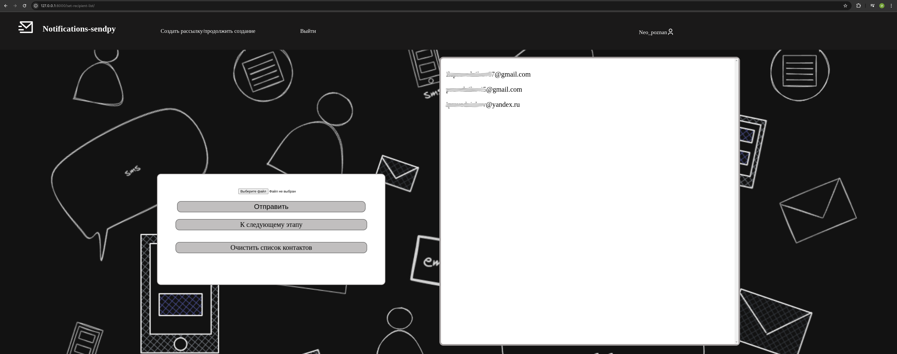

# Проект Notifications-sendpy
## Стек технологий
### Языки
* Python
* HTML
* CSS
### Брокер сообщений
* Kafka
### СУБД
* postgresql
### Библиотеки и фреймворки
* django
* aiokafka
* more-itertools
* psycopg2
### Способ отправки писем
* smtplib
## Реализованные фичи
* Позволяет рассылать сообщения по электронной почте большому количеству людей.
* В качестве данных отправителя использует электронную почту пользователя.
* Поддерживает как личную (не рекомендуется), так и корпоративную почту.
* Проверка данных пользователя на валидность в "боевых" условиях и гарантия доставки сообщений "Минимум 1 раз"
* Контакты получателей загружаются в виде CSV файла.
* HTML текстовый редактор для верстки сообщения
* Проект легко масштабируется: может быть задействовано большое количество воркеров для огромных рассылок.

## Интерфейс

## Простая и понятная инструкция по использованию сервиса находится на главной странице + инструкция в картинках по настройке своей электронной почты

## Как работает
Когда пользователь зарегистрировался и вошел в аккаунт ему нужно создать рассылку. Рассылка состоит из нескольких этапов. Нужно сначала загрузить файл с контактами, потом ввести данные smtp, создать сообщение и наконец отправить его. Когда пользователь нажимает кнопку "отправить сообщение ", то сервер сначала проверяет чтобы были введены все необходимые данные. Делается это через миксины. Когда данные проверены, то программа начинает формировать сообщения для кафки. Сообщения отправляются асинхронно. Каждое сообщение содержит в себе json с данными для подключения к smtp, одним контактом получателя, сообщением и его темой. Сообщения из кафки принимает другая программа - sendpy-worker. Она парсит json и с полученными оттуда данными создает соединение с почтовым сервером, после чего отправляет сообщения на почту.
## Как запустить у себя?
1. Клонировать репозиторий `git clone https://github.com/Neo-poznan/Notifications-sendpy.git`
2. Перейти в директорию `cd Notifications-sendpy`
3. Создать в этой директории виртуальное окружение `python3 -m venv env` а затем активировать его `source env/bin/activate`
4. Создать у себя переменные окружения Образцы переменных хранятся в файле .env.example. Если вы хотите просто протестировать проект, то можете не использовать postgresql, а раскомментировать в `settings.py` код отвечающий за sqlite и, соответственно, закомментировать все, что касается postgresql
5. Настроить кафку. Создать в ней топик `sendpy-topic` и в нем количество партиций пропорциональное количеству воркеров. Для этого нужно перейти в `директорию_с_кафкой/bin` и прописать 
`./kafka-topics.sh --bootstrap-server localhost:9092 --create --topic sendpy-topic` Чтобы создать партицию `./kafka-topics.sh --bootstrap-server localhost:9092 --alter --topic sendpy-topic --partitions 2` вместо `2` нужно написать нужное число партиций
6. Развернуть воркеры https://github.com/Neo-poznan/Sendpy-worker
7. Установить зависимости: `pip install -r requirements.txt`
8. Перейти в терминале в директорию src
9. Провести миграции `python3 manage.py migrate`
10. `python3 manage.py runserver`

## Как использовать api
Чтобы отправить рассылку из api нужно отправить post запрос на адрес `http(s)://ваш-домен/api/send-message`. В теле запроса должен быть json с парами ключ-значение: 
ключ `message` со строковым значением сообщения, ключ `message_subject` со значением - строкой с заголовком сообщения, ключ `recipient_email_list` со значением
в виде массива со строковыми значениями электронной почты получателей, ключ `sender_email` со значением строки электронной почты и ключ `smtp_password` со значением 
пароля входа на smtp-сервер с проставленными вручную пробелами(иначе может не сработать). Ключ `server_host` должен быть со значением хоста вашего почтового сервера, а ключ `server_port`
соответственно со значением порта. Если вы отправляете рассылку с личной почты gmail или yandex, то просто передайте пустые значения. 

